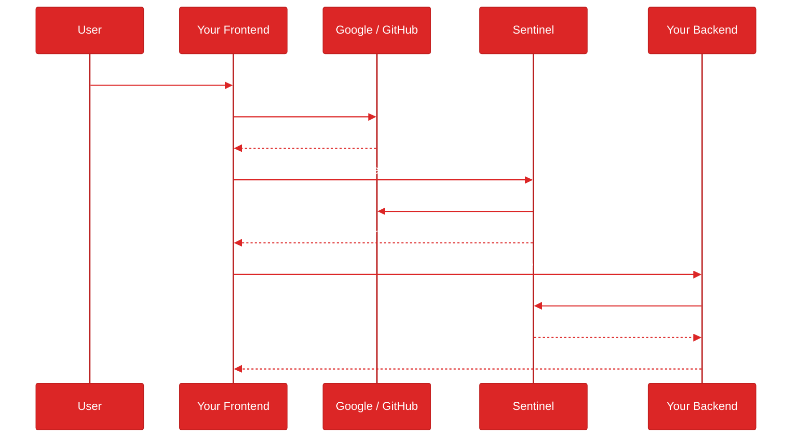
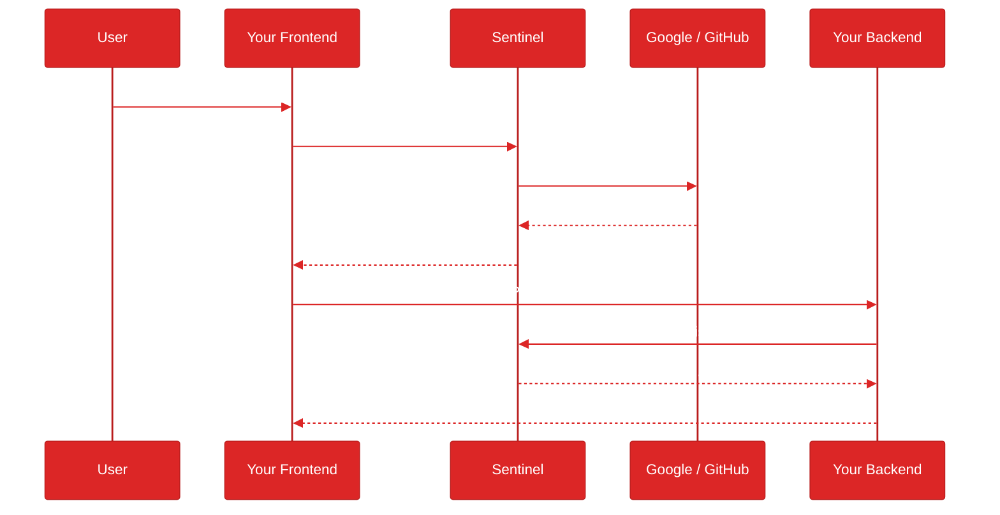

# Sentinel Auth


An authentication proxy and authorization microservice. Sentinel handles OAuth2/OIDC authentication from external IdPs, multi-tenant workspace management, and fine-grained Zanzibar-style permissions so you can focus on your application logic.

Ships with an Admin UI, Python SDK, and JS/TS SDK (React, Next.js).

## Status

[](https://github.com/sidxz/Sentinel/actions/workflows/ci.yml)
[](https://sidxz.github.io/Sentinel/)
[](https://pypi.org/project/sentinel-auth-sdk/)
[](https://www.npmjs.com/package/@sentinel-auth/js)
[](https://github.com/sidxz/Sentinel/pkgs/container/sentinel)
[](https://claude.ai/claude-code)
[](https://www.python.org/)
[](https://fastapi.tiangolo.com/)
[](https://www.postgresql.org/)
[](https://redis.io/)

## Two Integration Modes

**AuthZ mode (recommended)** — Your app handles IdP login directly (Google, GitHub, EntraID). Sentinel validates the IdP token and issues an authorization JWT. Dual-token design with `idp_sub` binding for security.

**Proxy mode** — Sentinel handles the full OAuth2/OIDC flow. Your app receives a single Sentinel-issued JWT. Simpler setup, but Sentinel sits in the login path.

## Capabilities

- **OAuth2/OIDC authentication** from Google, GitHub, Microsoft EntraID, or any OIDC provider
- **Three-tier authorization** — workspace roles (JWT claims), custom RBAC (DB), and entity ACLs (Zanzibar-style)
- **Multi-tenant workspaces** — users, groups, roles, and permissions are scoped per workspace
- **Token lifecycle** — RS256 JWTs, refresh rotation, reuse detection, Redis denylist
- **Admin panel** — React SPA for managing workspaces, users, roles, permissions, and service apps
- **Python SDK** — `pip install sentinel-auth-sdk` with middleware, FastAPI dependencies, and HTTP clients
- **JS/TS SDK** — `@sentinel-auth/js`, `@sentinel-auth/react`, `@sentinel-auth/nextjs` for browser, React, and Next.js
- **DDD support** — `RequestAuth` bridge for clean architecture with framework-agnostic `AuthContext` protocol
- **JWKS endpoint** — `/.well-known/jwks.json` for automatic key discovery
- **Security hardened** — rate limiting, CORS, HSTS, CSP, trusted hosts, session encryption

> **BETA SOFTWARE WARNING**
> This software is currently in beta and **not fully production ready**. While functional and actively developed, it may contain bugs, incomplete features, or breaking changes. Use in production environments at your own risk. Contributions and feedback are welcome!

## Documentation

Full documentation at [sidxz.github.io/Sentinel](https://sidxz.github.io/Sentinel/)

## Architecture

### AuthZ Mode (recommended)

Your app handles IdP login. Sentinel validates the IdP token and issues an authorization JWT.



### Proxy Mode

Sentinel handles the full OAuth flow. Your app receives a single JWT.



## Authorization Model

| Tier | Mechanism | Granularity | Example |
|------|-----------|-------------|---------|
| **Workspace Roles** | JWT claims | Coarse | "Is user an editor in this workspace?" |
| **Custom RBAC** | DB roles + actions | Action-level | "Can user export reports?" |
| **Entity ACLs** | Zanzibar-style DB | Per-resource | "Can user edit document X?" |

## Quick Start

### From source

```bash
git clone <repo-url> && cd identity-service
make setup    # generates JWT keys, TLS certs, .env files, installs deps, starts Postgres + Redis
```

`make setup` is idempotent. Once complete, configure an OAuth provider:

```bash
vim service/.env    # add GOOGLE_CLIENT_ID, GOOGLE_CLIENT_SECRET (or GitHub/EntraID), ADMIN_EMAILS
```

Then start:

```bash
make start    # identity service on :9003 (auto-migrates DB on boot)
make admin    # admin panel on :9004
make seed     # (optional) populate test data
```

### Docker

```bash
make setup
vim .env.prod           # set BASE_URL, ADMIN_URL, OAuth creds, ADMIN_EMAILS
docker compose -f docker-compose.prod.yml up -d
```

### Next steps

1. Sign in to the **admin panel** (`http://localhost:9004`) — your `ADMIN_EMAILS` user is auto-promoted on first login.
2. Register a **service app** (API key for your backend + allowed origins for your frontend).
3. Integrate using the [Python SDK](#python-sdk) or [JS/TS SDK](#jsts-sdk).

See the [Getting Started guide](https://sidxz.github.io/Sentinel/getting-started/) for the full walkthrough.

## Python SDK

```bash
pip install sentinel-auth-sdk
```

```python
from fastapi import FastAPI, Depends
from sentinel_auth import Sentinel

sentinel = Sentinel(
    base_url="http://localhost:9003",
    service_name="my-service",
    service_key="sk_...",
    mode="authz",
    idp_jwks_url="https://www.googleapis.com/oauth2/v3/certs",
    actions=[
        {"action": "reports:export", "description": "Export reports"},
    ],
)

app = FastAPI(lifespan=sentinel.lifespan)
sentinel.protect(app)

# Tier 1: workspace role from JWT
@app.get("/projects")
async def list_projects(user=Depends(sentinel.require_user)):
    return await get_projects(user.workspace_id)

# Tier 2: RBAC action check
@app.get("/reports/export")
async def export(user=Depends(sentinel.require_action("reports:export"))):
    ...

# Tier 3: entity-level permission
@app.get("/projects/{id}")
async def get_project(id: str, auth=Depends(sentinel.get_auth)):
    if not await auth.can("project", id, "view"):
        raise HTTPException(403)
    ...
```

For DDD / Clean Architecture integration, see the [DDD guide](https://sidxz.github.io/Sentinel/sdk/ddd/).

## JS/TS SDK

```bash
npm install @sentinel-auth/js @sentinel-auth/react
```

```tsx
import { AuthzClient } from "@sentinel-auth/js";
import { SentinelAuthProvider, AuthGuard, useAuth, useUser } from "@sentinel-auth/react";

const client = new AuthzClient({
  sentinelUrl: "http://localhost:9003",
  provider: "google",
  googleClientId: "...",
});

function App() {
  return (
    <SentinelAuthProvider client={client}>
      <AuthGuard fallback={<Login />}>
        <Dashboard />
      </AuthGuard>
    </SentinelAuthProvider>
  );
}

function Login() {
  const { login } = useAuth();
  return <button onClick={() => login()}>Sign in with Google</button>;
}

function Dashboard() {
  const user = useUser();
  return <p>{user.name} ({user.workspaceRole})</p>;
}
```

For Next.js, see `@sentinel-auth/nextjs` with Edge Middleware and server-side JWT verification.

## Project Structure

```
├── service/              # FastAPI microservice
├── sdk/                  # Python SDK (sentinel-auth-sdk)
├── sdks/                 # JS/TS SDKs (js, react, nextjs)
├── admin/                # React admin panel (Vite + TailwindCSS)
├── demo-authz/           # Demo app — AuthZ mode (Next.js + FastAPI)
├── demo-proxy/           # Demo app — Proxy mode (React + FastAPI)
├── pentest/              # Security testing suite
├── docs/                 # Documentation site (MkDocs Material)
├── docker-compose.yml    # Dev containers (PostgreSQL + Redis)
└── Makefile              # setup, start, admin, seed, lint, docs, pentest
```

## Security

Defense-in-depth middleware, per-endpoint rate limiting, and a comprehensive penetration testing suite. See the [security documentation](https://sidxz.github.io/Sentinel/security/).

## Contributing

See the [contributing guide](https://sidxz.github.io/Sentinel/contributing/).

## License

MIT
