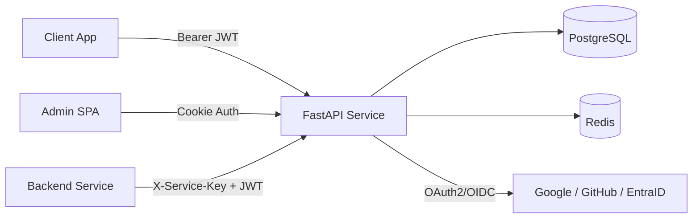
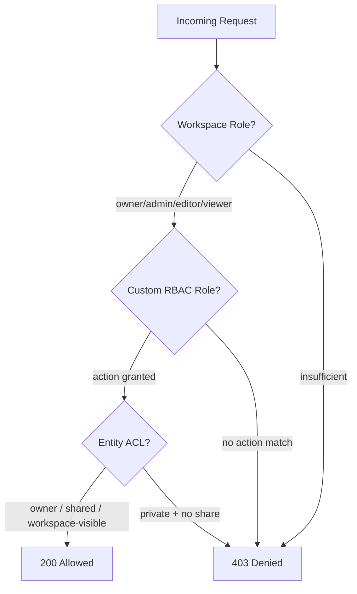

# DAIKON IDENTITY SERVICE

A production-ready authentication, workspace management, and entity-level permissions microservice. Built for teams that need SSO-first identity with fine-grained authorization — without the complexity of Keycloak or Ory.

## Status

[](https://github.com/sidxz/DIS/actions/workflows/ci.yml)
[](https://sidxz.github.io/DIS/)
[](https://www.python.org/)
[](https://fastapi.tiangolo.com/)
[](https://www.postgresql.org/)
[](https://redis.io/)

## Why it exists

Modern microservice architectures need a central identity layer that does more than just login. Daikon Identity Service handles the full lifecycle: external IdP login (Google, GitHub, Microsoft EntraID), workspace isolation, group management, and a three-tier authorization model that scales from coarse role checks to per-resource Zanzibar-style ACLs.

Users always come from external identity providers — there is no local password management. The service stores a synced user record on login and manages everything else.

## Capabilities

- **SSO-first authentication** via OAuth2/OIDC with PKCE (Google, GitHub, Microsoft EntraID, any OIDC provider).
- **Three-tier authorization** — workspace roles (JWT claims), custom RBAC roles (DB), and entity ACLs (Zanzibar-style).
- **Token lifecycle** with RS256 JWTs, refresh rotation, reuse detection, and Redis denylist revocation.
- **Workspace isolation** — users, groups, roles, and permissions are scoped per workspace.
- **Admin panel** — React SPA with full CRUD, audit logs, CSV import/export, and role management.
- **SDK** — pip-installable `daikon-identity-sdk` with middleware, FastAPI dependencies, and HTTP clients.
- **Security hardened** — rate limiting, CORS, HSTS, CSP, trusted hosts, session encryption, and a comprehensive pentest suite.

## Architecture at a glance



## Authorization model



| Tier | Mechanism | Granularity | Example |
|------|-----------|-------------|---------|
| **Workspace Roles** | JWT claims | Coarse | "Is user an editor in this workspace?" |
| **Custom RBAC** | DB roles + actions | Action-level | "Can user export reports?" |
| **Entity ACLs** | Zanzibar-style DB | Per-resource | "Can user edit document X?" |

## Quick start

```bash
# One-time setup: generates keys, installs deps, starts Postgres + Redis
make setup

# Start the identity service on :9003
make start

# Start the admin panel on :9004
make admin

# (Optional) Seed with test data
make seed
```

The API is available at `http://localhost:9003` with interactive docs at `/docs`.

## SDK usage

Install the SDK in your consuming service:

```bash
pip install daikon-identity-sdk
```

Add JWT middleware and use dependency injection:

```python
from fastapi import FastAPI, Depends
from identity_sdk.middleware import JWTAuthMiddleware
from identity_sdk.dependencies import get_current_user, require_role
from identity_sdk.types import AuthenticatedUser

app = FastAPI()
app.add_middleware(JWTAuthMiddleware, public_key=open("public.pem").read())

@app.get("/things")
async def list_things(user: AuthenticatedUser = Depends(get_current_user)):
    return await fetch_things(workspace_id=user.workspace_id)

@app.post("/things")
async def create_thing(user: AuthenticatedUser = Depends(require_role("editor"))):
    ...
```

Check entity-level permissions from any backend service:

```python
from identity_sdk.permissions import PermissionClient

perm = PermissionClient(base_url="http://localhost:9003", service_name="my-app")

allowed = await perm.can(token=jwt, resource_type="document", resource_id=doc_id, action="edit")
```

## Project structure

```
identity-service/
├── service/              # FastAPI microservice (auth, users, workspaces, permissions, RBAC)
├── sdk/                  # Pip-installable SDK (middleware, dependencies, HTTP clients)
├── admin/                # React admin panel (Vite + TailwindCSS)
├── pentest/              # Security testing suite (ZAP, Nuclei, Nikto, jwt_tool + 110 custom tests)
├── docs/                 # Documentation site (MkDocs Material)
├── docker-compose.yml    # PostgreSQL 16 + Redis 7
└── Makefile              # setup, start, admin, seed, pentest, docs
```

## API overview

| Group | Key Endpoints | Auth Tier |
|-------|---------------|-----------|
| **Auth** | `login/{provider}`, `callback/{provider}`, `refresh`, `logout` | Public / User JWT |
| **Users** | `GET/PATCH /users/me` | User JWT |
| **Workspaces** | CRUD + member invite/remove | User JWT (role-gated) |
| **Groups** | CRUD + member management | User JWT (role-gated) |
| **Permissions** | `check`, `register`, `share`, `accessible` | Service Key + JWT |
| **Roles (RBAC)** | `register-actions`, `check-action`, `user-actions` | Service Key + JWT |
| **Admin** | Full CRUD, audit logs, CSV export, system settings | Admin Cookie |

## Security

The service ships with defense-in-depth middleware, per-endpoint rate limiting, and a comprehensive penetration testing suite. See the [security documentation](https://sidxz.github.io/DIS/security/) for the full architecture.

```bash
# Run the pentest suite
make pentest-setup    # install tools (one-time)
make pentest          # ZAP + Nuclei + Nikto + jwt_tool + custom scripts
```

## Documentation

Full documentation is hosted at [sidxz.github.io/DIS](https://sidxz.github.io/DIS/) — covering getting started, architecture guides, API reference, SDK reference, deployment, and security.

```bash
# Serve docs locally
make docs-serve
```

## License

MIT
