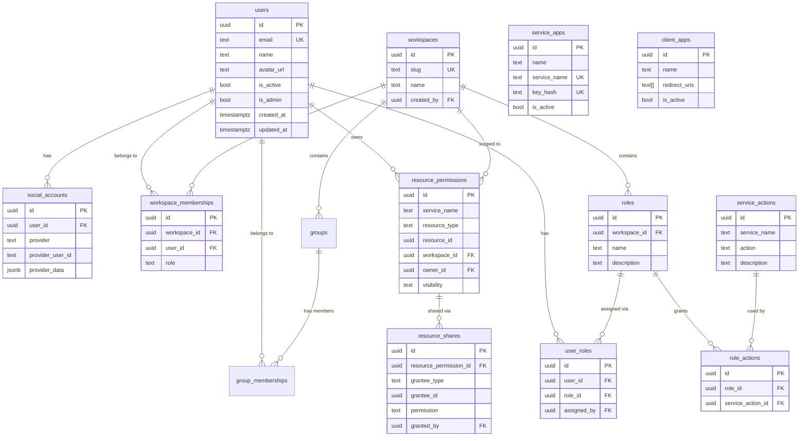

# Database Schema

Sentinel uses PostgreSQL 16 with SQLAlchemy 2.0 async and Alembic for migrations.

---

## Tables

15 tables across five domains:

| Domain | Tables |
|--------|--------|
| **Users** | `users`, `social_accounts` |
| **Workspaces** | `workspaces`, `workspace_memberships`, `groups`, `group_memberships` |
| **Permissions** | `resource_permissions`, `resource_shares` |
| **RBAC** | `service_actions`, `roles`, `role_actions`, `user_roles` |
| **App Registration** | `service_apps`, `client_apps` |
| **System** | `activity_log` |

---

## Entity Relationship Diagram



---

## Conventions

- All primary keys are UUID v4, generated client-side
- Timestamps use `DateTime(timezone=True)` with `server_default=func.now()`
- Cascade deletes configured at the database level (`ondelete="CASCADE"`)
- Check constraints enforce valid enum values (roles, visibility, permissions)
- Composite unique constraints prevent duplicate memberships and shares

### Key Constraints

| Constraint | Table | Purpose |
|------------|-------|---------|
| `uq_workspace_member` | `workspace_memberships` | One membership per user per workspace |
| `uq_resource_identity` | `resource_permissions` | One record per service+type+id |
| `uq_resource_share` | `resource_shares` | One share per resource per grantee |
| `uq_service_action` | `service_actions` | One action per service name |
| `uq_workspace_role_name` | `roles` | Unique role names within a workspace |
| `ck_membership_role` | `workspace_memberships` | Role must be owner/admin/editor/viewer |
| `ck_visibility` | `resource_permissions` | Must be private/workspace |
| `ck_share_permission` | `resource_shares` | Must be view/edit |

---

## Migrations

Alembic manages schema changes. Migrations run automatically on service startup (configured in `main.py` lifespan), so manual runs are rarely needed.

### Create a Migration

After modifying a model:

```bash
cd service && uv run alembic revision --autogenerate -m "description of change"
```

Review the generated `upgrade()` and `downgrade()` functions in `service/migrations/versions/` before committing.

### Manual Commands

```bash
cd service && uv run alembic upgrade head     # Apply all pending
cd service && uv run alembic current          # Show current revision
cd service && uv run alembic downgrade -1     # Roll back one step
```
