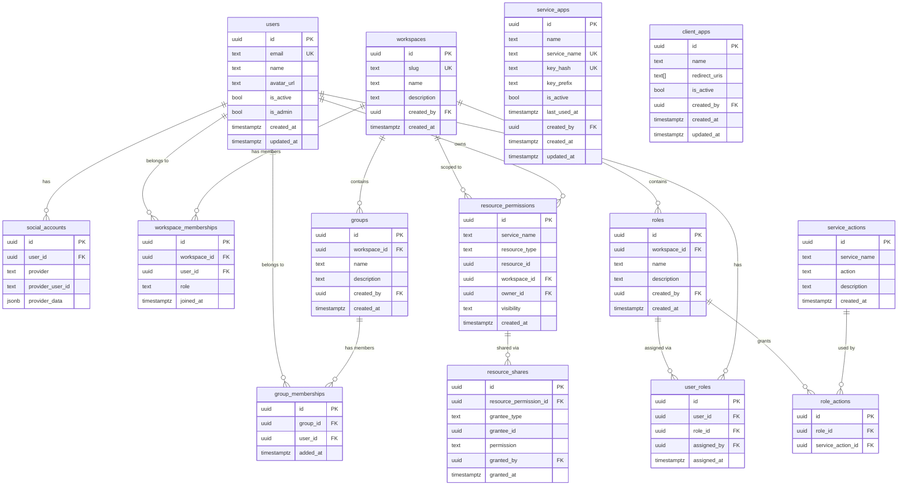

# Database

The Sentinel Auth uses PostgreSQL 16 with SQLAlchemy 2.0 async as the ORM layer and Alembic for schema migrations.

## Tables

The database consists of 15 tables across five domains:

### Users

| Table | Description |
|-------|-------------|
| `users` | Core user records. Created on first OAuth login. |
| `social_accounts` | OAuth provider links (Google, GitHub, Entra ID). One user can have multiple. |

### Workspaces

| Table | Description |
|-------|-------------|
| `workspaces` | Organizational containers. Each has a unique slug. |
| `workspace_memberships` | Maps users to workspaces with a role (`owner`, `admin`, `editor`, `viewer`). |
| `groups` | Named groups within a workspace for bulk permission grants. |
| `group_memberships` | Maps users to groups. |

### Permissions

| Table | Description |
|-------|-------------|
| `resource_permissions` | Registers a resource from an external service with an owner and visibility level. |
| `resource_shares` | Grants a specific user or group access to a resource (`view` or `edit`). |

### RBAC (Custom Roles)

| Table | Description |
|-------|-------------|
| `service_actions` | Actions registered by external services (e.g., `reports:export`). Unique per `service_name` + `action`. |
| `roles` | Custom roles scoped to a workspace. Each has a unique name within its workspace. |
| `role_actions` | Maps roles to service actions, defining what a role can do. |
| `user_roles` | Assigns users to custom roles within a workspace. |

### Application Registration

| Table | Description |
|-------|-------------|
| `service_apps` | Backend services that authenticate via API key (`X-Service-Key`). Keys are stored as SHA-256 hashes. |
| `client_apps` | Frontend/client applications. Registered with a redirect URI allowlist (no client secrets). |

### System

| Table | Description |
|-------|-------------|
| `activity_log` | Tracks admin and system actions for auditing. |

## Entity Relationship Diagram



## SQLAlchemy Conventions

The project uses SQLAlchemy 2.0 with the `mapped_column` declarative style:

```python
from sqlalchemy.orm import Mapped, mapped_column

class User(Base):
    __tablename__ = "users"

    id: Mapped[uuid.UUID] = mapped_column(
        UUID(as_uuid=True), primary_key=True, default=uuid.uuid4
    )
    email: Mapped[str] = mapped_column(Text, unique=True, nullable=False)
    name: Mapped[str] = mapped_column(Text, nullable=False)
```

Key patterns:

- All primary keys are UUID v4, generated client-side.
- Timestamps use `DateTime(timezone=True)` with `server_default=func.now()`.
- Cascade deletes are configured at the database level with `ondelete="CASCADE"`.
- Check constraints enforce valid enum values (e.g., roles, visibility, permission levels).
- Composite unique constraints prevent duplicate memberships and shares.

## Migrations

Alembic manages database schema changes. Migrations run automatically when the service starts (configured in `main.py`'s lifespan handler), so there is no need to run them manually during development.

### Creating a New Migration

After modifying a model, generate a migration script:

```bash
cd service && uv run alembic revision --autogenerate -m "description of change"
```

This creates a new file in `service/migrations/versions/`. Review the generated `upgrade()` and `downgrade()` functions before committing.

### Running Migrations Manually

```bash
cd service && uv run alembic upgrade head
```

### Viewing Current Revision

```bash
cd service && uv run alembic current
```

### Rolling Back

```bash
cd service && uv run alembic downgrade -1
```

## Constraints and Indexes

The schema uses several constraint and indexing patterns worth noting:

| Constraint | Table | Purpose |
|------------|-------|---------|
| `uq_social_provider_user` | `social_accounts` | One account per provider per external user |
| `uq_workspace_member` | `workspace_memberships` | A user can join a workspace only once |
| `uq_workspace_group_name` | `groups` | Group names are unique within a workspace |
| `uq_group_member` | `group_memberships` | A user can be in a group only once |
| `uq_resource_identity` | `resource_permissions` | One permission record per service+type+id |
| `uq_resource_share` | `resource_shares` | One share per resource per grantee |
| `ck_membership_role` | `workspace_memberships` | Role must be owner/admin/editor/viewer |
| `ck_visibility` | `resource_permissions` | Visibility must be private/workspace |
| `ck_grantee_type` | `resource_shares` | Grantee type must be user/group |
| `ck_share_permission` | `resource_shares` | Permission must be view/edit |
| `uq_service_action` | `service_actions` | One action per service name |
| `uq_workspace_role_name` | `roles` | Role names are unique within a workspace |
| `uq_role_action` | `role_actions` | A role can grant an action only once |
| `uq_user_role` | `user_roles` | A user can be assigned a role only once |

Indexes are defined on foreign keys and common lookup patterns (e.g., `ix_resource_permissions_lookup` on `service_name + resource_type + resource_id`, `ix_service_actions_service_name`, `ix_service_apps_key_hash`).
