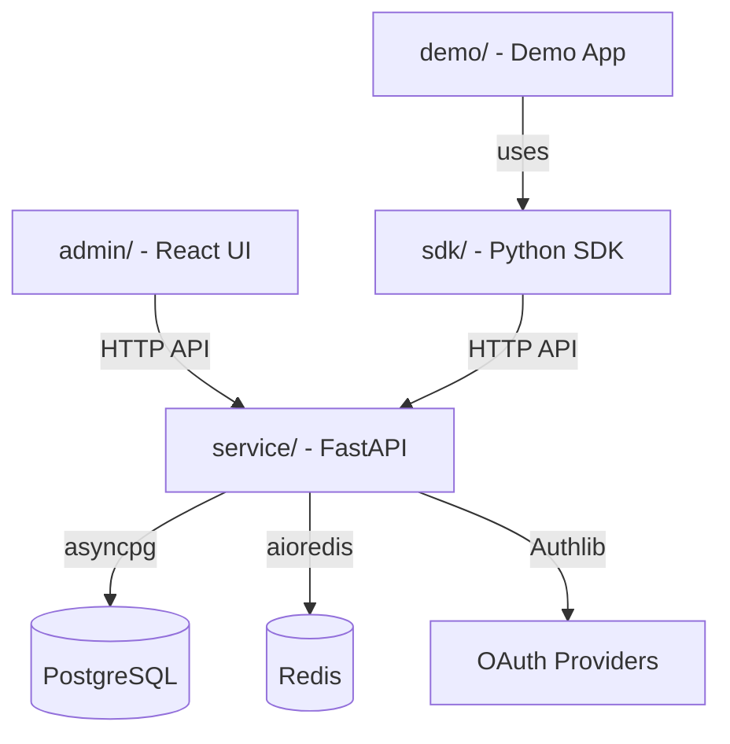

# Project Structure

The Sentinel Auth is organized as a uv workspace with multiple packages. Here is the full directory tree with annotations.

```
sentinel/
├── service/                        # FastAPI microservice
│   ├── src/
│   │   ├── main.py                # App factory + lifespan (auto-runs migrations)
│   │   ├── config.py              # Pydantic Settings (all env vars)
│   │   ├── database.py            # SQLAlchemy async engine + session factory
│   │   ├── models/                # SQLAlchemy ORM models
│   │   │   ├── user.py           #   User, SocialAccount
│   │   │   ├── workspace.py      #   Workspace, WorkspaceMembership
│   │   │   ├── group.py          #   Group, GroupMembership
│   │   │   ├── permission.py     #   ResourcePermission, ResourceShare
│   │   │   ├── role.py           #   ServiceAction, Role, RoleAction, UserRole
│   │   │   ├── service_app.py    #   ServiceApp (backend API key auth)
│   │   │   ├── client_app.py     #   ClientApp (frontend redirect URI allowlist)
│   │   │   └── activity.py       #   ActivityLog
│   │   ├── schemas/               # Pydantic request/response schemas
│   │   │   └── permission.py     #   Permission-related schemas
│   │   ├── services/              # Business logic layer
│   │   │   ├── auth_service.py   #   OAuth flow + user upsert
│   │   │   ├── permission_service.py  # Permission checks + ACL queries
│   │   │   └── token_service.py  #   Token creation, refresh, revocation
│   │   ├── auth/                  # Authentication internals
│   │   │   ├── jwt.py            #   JWT encode/decode, RS256
│   │   │   └── providers.py      #   Authlib OAuth client configs
│   │   ├── api/                   # FastAPI routers (one per domain)
│   │   │   ├── auth_routes.py    #   /auth/* (login, callback, refresh)
│   │   │   ├── user_routes.py    #   /users/*
│   │   │   ├── workspace_routes.py   # /workspaces/*
│   │   │   ├── group_routes.py   #   /groups/*
│   │   │   ├── permission_routes.py  # /permissions/*
│   │   │   ├── role_routes.py    #   /roles/* (RBAC service-facing API)
│   │   │   ├── admin_routes.py   #   /admin/* (admin panel API)
│   │   │   └── dependencies.py   #   Shared FastAPI dependencies
│   │   └── middleware/            # ASGI middleware
│   │       └── ...               #   Security headers, rate limiting
│   ├── migrations/                # Alembic migration scripts
│   │   ├── env.py
│   │   └── versions/
│   ├── Dockerfile
│   └── pyproject.toml             # Service-specific dependencies
│
├── sdk/                           # Python SDK (pip-installable)
│   ├── src/sentinel_auth/
│   │   ├── __init__.py
│   │   ├── types.py              # AuthenticatedUser, WorkspaceContext, SentinelError
│   │   ├── middleware.py         # JWTAuthMiddleware (Starlette)
│   │   ├── dependencies.py       # FastAPI deps (get_current_user, etc.)
│   │   ├── permissions.py        # PermissionClient (httpx async)
│   │   ├── roles.py              # RoleClient (RBAC action checks, httpx async)
│   │   └── sentinel.py           # Sentinel autoconfig class (one-line integration)
│   ├── tests/                    # SDK test suite (pytest + respx)
│   └── pyproject.toml            # Published as sentinel-auth-sdk
│
├── sdks/                          # JavaScript/TypeScript SDKs
│   ├── js/                       #   @sentinel-auth/js (browser + server)
│   ├── react/                    #   @sentinel-auth/react (provider, hooks)
│   └── nextjs/                   #   @sentinel-auth/nextjs (middleware, helpers)
│
├── admin/                         # React admin panel
│   ├── src/
│   └── package.json
│
├── demo/                          # Demo app showing SDK usage
│
├── scripts/                       # Utility scripts
│   ├── seed.py                   # Populate DB with test data
│   └── create_admin.py           # Create/promote admin users
│
├── keys/                          # JWT RSA keys (git-ignored)
│   ├── private.pem
│   └── public.pem
│
├── docs/                          # MkDocs documentation (this site)
│
├── docker-compose.yml             # PostgreSQL + Redis + service
├── Makefile                       # Developer commands
├── mkdocs.yml                     # MkDocs configuration
├── pyproject.toml                 # Root workspace (uv workspace)
└── uv.lock                       # Locked dependencies
```

## Component Relationships



## Package Layout

The project uses a **uv workspace** defined in the root `pyproject.toml`:

```toml
[tool.uv.workspace]
members = ["service", "sdk"]
```

Each member has its own `pyproject.toml` with independent dependencies. The root `uv.lock` resolves all dependencies across the workspace.

- **`service/`** depends on the full stack: FastAPI, SQLAlchemy, Authlib, Redis, etc.
- **`sdk/`** is lightweight by design: only `httpx`, `pyjwt`, `cryptography`, and `starlette`.
- The SDK is published to PyPI as `sentinel-auth-sdk` and imported as `sentinel_auth`.

## Key Files

| File | Purpose |
|------|---------|
| `service/src/main.py` | Application entry point. Configures middleware, mounts routers, runs migrations on startup. |
| `service/src/config.py` | Central configuration via Pydantic Settings. All env vars defined here. |
| `service/src/database.py` | Creates the async SQLAlchemy engine and `async_sessionmaker`. |
| `service/src/api/dependencies.py` | Shared FastAPI dependencies for auth extraction and DB sessions. |
| `service/src/auth/jwt.py` | JWT token creation and verification using RS256. |
| `service/src/auth/providers.py` | Authlib OAuth client configuration for Google, GitHub, Entra ID. |
