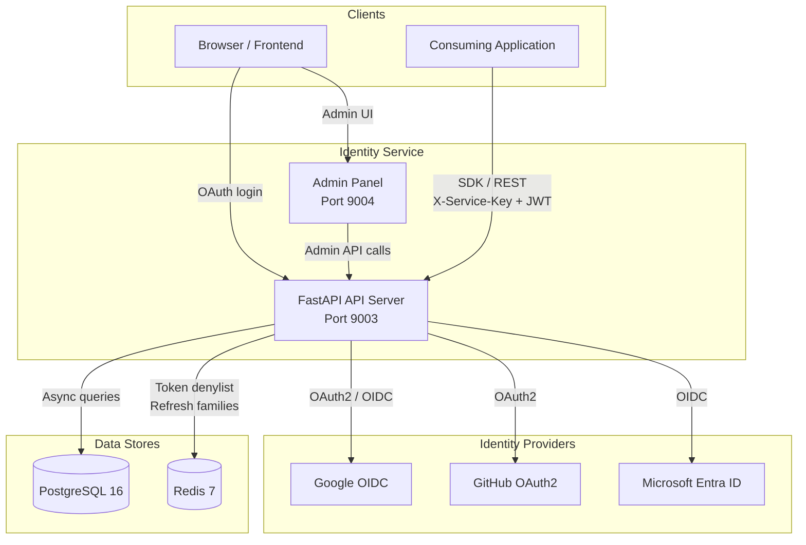
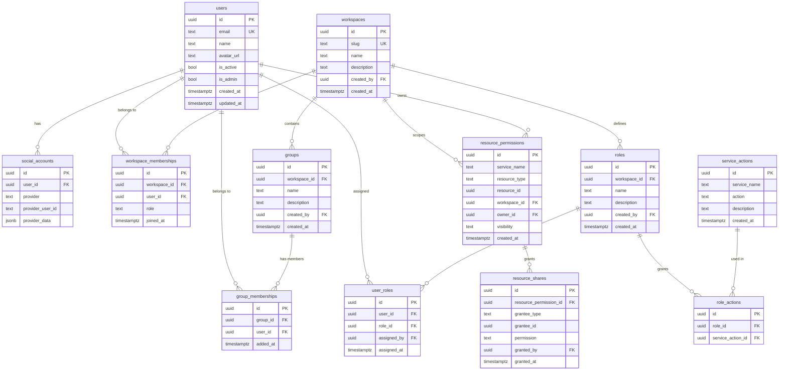

# Architecture

## System Overview

The Daikon Identity Service is a centralized authentication and authorization platform that sits between your applications and external identity providers. It handles user lifecycle, workspace tenancy, group management, and a Zanzibar-style permission system -- all exposed through a REST API and a companion Python SDK.

## Design Decisions

### D1: Authlib over raw OAuth2

We use [Authlib](https://authlib.org/) as the OAuth2/OIDC client library rather than building OAuth flows from scratch. Authlib handles PKCE challenge generation, OIDC discovery, token exchange, and ID token validation out of the box. This lets us focus on business logic (user matching, token issuance, workspace context) rather than protocol plumbing.

### D2: PostgreSQL for relational data

PostgreSQL 16 is the single source of truth for users, workspaces, groups, and permissions. Its strong consistency guarantees, UUID support, JSONB columns (for provider metadata), and mature async driver (`asyncpg`) make it the natural choice for an identity store where correctness matters more than write throughput.

### D3: Soft isolation via workspace_id

Rather than provisioning a separate database per tenant, we use a `workspace_id` foreign key on all tenant-scoped tables. Every query filters by `workspace_id` -- enforced at the service layer and validated against the JWT. This approach keeps the operational footprint simple (one database, one connection pool) while still providing logical tenant isolation.

### D4: Stateless JWT with Redis-backed revocation

Access tokens are stateless RS256 JWTs containing the full user context (user ID, workspace, role, groups). This means consuming applications can validate tokens locally using the public key without calling the Identity Service on every request. For the minority of cases where a token must be revoked before expiry (logout, password change), we maintain a lightweight `jti` denylist in Redis with automatic TTL expiration.

### D5: Custom build, not Keycloak

We chose to build a purpose-built identity service rather than deploying Keycloak, Ory, or another off-the-shelf solution. The reasons:

- **Full control** over the permission model (Zanzibar-style entity ACLs are not a standard Keycloak feature)
- **Minimal footprint** -- a single Python process rather than a JVM-based application server
- **Deep integration** with our workspace and group model, which maps directly to our multi-tenant product architecture
- **SDK-first design** -- the Python SDK is a first-class citizen, not an afterthought

## Tech Stack

| Component | Technology | Purpose |
|-----------|-----------|---------|
| Web framework | FastAPI | Async HTTP server with OpenAPI docs |
| OAuth2/OIDC | Authlib | Provider integration, PKCE, token exchange |
| JWT signing | PyJWT | RS256 token creation and validation |
| ORM | SQLAlchemy 2.0 (async) | Database models and queries |
| DB driver | asyncpg | High-performance async PostgreSQL driver |
| Migrations | Alembic | Schema versioning and migration |
| Validation | Pydantic v2 | Request/response schemas |
| Cache/state | Redis 7 | Token denylist, refresh token families |
| Logging | structlog | Structured JSON logging |
| Rate limiting | slowapi | Per-endpoint rate limits |

## Entity-Relationship Diagram

### Key constraints

- `social_accounts` has a unique constraint on `(provider, provider_user_id)` -- a provider account maps to exactly one user.
- `workspace_memberships` has a unique constraint on `(workspace_id, user_id)` and a check constraint limiting `role` to `owner`, `admin`, `editor`, or `viewer`.
- `groups` has a unique constraint on `(workspace_id, name)` -- group names are unique within a workspace.
- `resource_permissions` has a unique constraint on `(service_name, resource_type, resource_id)` -- each resource is registered exactly once.
- `resource_shares` has a unique constraint on `(resource_permission_id, grantee_type, grantee_id)` -- a grantee gets at most one share per resource.
- `service_actions` has a unique constraint on `(service_name, action)` -- each action is registered exactly once per service.
- `roles` has a unique constraint on `(workspace_id, name)` -- role names are unique within a workspace.
- `role_actions` has a unique constraint on `(role_id, service_action_id)` -- an action can only be added to a role once.
- `user_roles` has a unique constraint on `(user_id, role_id)` -- a user can only be assigned to a role once.
