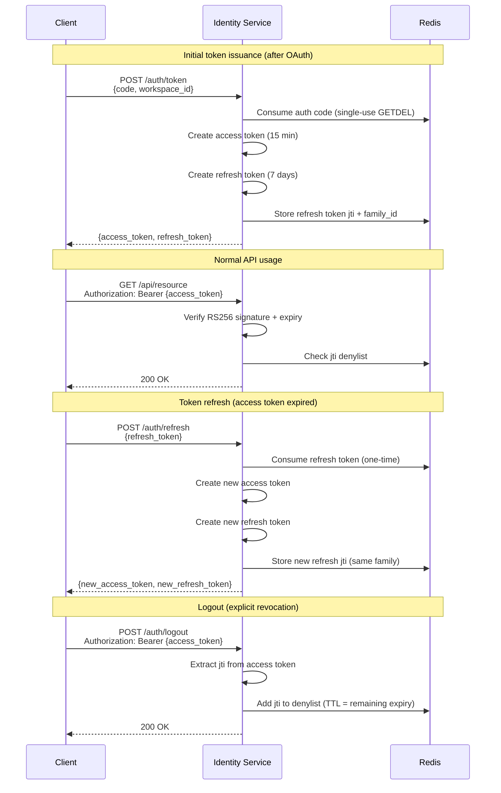

# JWT Tokens

The Sentinel Auth issues JSON Web Tokens (JWTs) for authentication. Tokens are signed with RS256 (RSA + SHA-256) using a private key, and can be verified by any service holding the corresponding public key.

## Token Types

### Access Token

| Property | Value |
|----------|-------|
| Algorithm | RS256 |
| Expiry | 15 minutes (configurable via `ACCESS_TOKEN_EXPIRE_MINUTES`) |
| Purpose | Authenticate API requests; carries full user context |
| Usage | Sent as `Authorization: Bearer <token>` header |

### Refresh Token

| Property | Value |
|----------|-------|
| Algorithm | RS256 |
| Expiry | 7 days (configurable via `REFRESH_TOKEN_EXPIRE_DAYS`) |
| Purpose | Obtain new access/refresh token pair |
| Usage | Sent to `POST /auth/refresh` endpoint; one-time use |

### Admin Token

| Property | Value |
|----------|-------|
| Algorithm | RS256 |
| Expiry | 8 hours |
| Purpose | Authenticate admin panel requests |
| Usage | Stored in `admin_token` HttpOnly cookie |

## Access Token Claims

| Claim | Type | Description |
|-------|------|-------------|
| `sub` | `string` (UUID) | User ID |
| `email` | `string` | User's email address |
| `name` | `string` | User's display name |
| `wid` | `string` (UUID) | Current workspace ID |
| `wslug` | `string` | Current workspace slug |
| `wrole` | `string` | Workspace role: `owner`, `admin`, `editor`, or `viewer` |
| `groups` | `string[]` (UUIDs) | Group IDs the user belongs to in this workspace |
| `jti` | `string` (UUID) | Unique token identifier (for revocation) |
| `iat` | `number` | Issued-at timestamp (Unix epoch) |
| `exp` | `number` | Expiration timestamp (Unix epoch) |
| `type` | `string` | Always `"access"` |

### Refresh Token Claims

| Claim | Type | Description |
|-------|------|-------------|
| `sub` | `string` (UUID) | User ID |
| `jti` | `string` (UUID) | Unique token identifier (for rotation tracking) |
| `iat` | `number` | Issued-at timestamp |
| `exp` | `number` | Expiration timestamp |
| `type` | `string` | Always `"refresh"` |

## RS256 Signing

Tokens are signed using an RSA private key and verified using the corresponding public key. This asymmetric scheme means that consuming applications only need the public key to validate tokens -- they never need access to the private key.

Key paths are configured via environment variables:

```
JWT_PRIVATE_KEY_PATH=keys/private.pem   # Used by the Identity Service to sign tokens
JWT_PUBLIC_KEY_PATH=keys/public.pem     # Distributed to consuming services for verification
```

Generate a key pair:

```bash
openssl genrsa -out keys/private.pem 2048
openssl rsa -in keys/private.pem -pubout -out keys/public.pem
```

## Token Lifecycle



## Refresh Token Rotation

Every refresh token is single-use. When a client presents a refresh token to `POST /auth/refresh`:

1. The service **consumes** the token by deleting its `jti` from Redis (atomic `GETDEL`).
2. A new access token and a new refresh token are issued.
3. The new refresh token is stored in Redis under the **same family ID** as the consumed token.
4. The old refresh token can never be used again.

### Reuse Detection

Refresh tokens are organized into **families**. A family is created when tokens are first issued (e.g., after login) and all subsequent rotations within that session share the same family ID.

If a consumed refresh token is presented again (meaning it was already used), this signals possible token theft. In this scenario:

- The request is rejected with a `401` error.
- The entire token family can be revoked, invalidating all refresh tokens in the chain.
- The legitimate user and the attacker both lose their sessions, forcing re-authentication.

### Redis Data Model

```
ac:{code}         -> JSON {user_id}                           # TTL = 5 minutes (auth codes)
rt:{jti}          -> "{user_id}:{family_id}"    # TTL = refresh_token_expire_days
rtf:{family_id}   -> SET of jtis                # TTL = refresh_token_expire_days
bl:{jti}          -> "1"                        # TTL = remaining access token lifetime
```

## Access Token Revocation

Access tokens are stateless by design -- the service does not need to check a database on every request. However, there are cases where an access token must be invalidated before its natural expiry (e.g., user logout, account deactivation).

The service maintains a **jti denylist** in Redis:

- On `POST /auth/logout`, the access token's `jti` is added to the denylist with a TTL equal to the token's remaining lifetime.
- On every authenticated request, the `get_current_user` dependency checks if the token's `jti` exists in the denylist.
- Entries automatically expire from Redis when the original token would have expired, keeping the denylist small.

This approach provides a good balance: most requests are fully stateless (no Redis call needed if the token is valid and the `jti` is not in the denylist), while still supporting revocation when needed.
