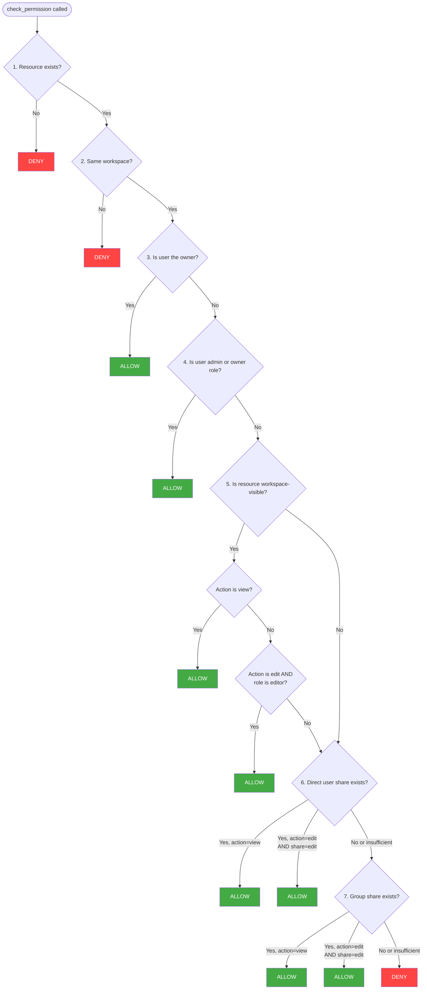

# Permissions

The Daikon Identity Service implements a three-tier authorization model: workspace roles (stateless, embedded in the JWT), custom RBAC roles (action-based, resolved via service calls), and entity-level access control lists (Zanzibar-style, resolved via service calls). This design keeps common authorization checks fast while supporting both action-based and resource-level fine-grained access control.

## Three-Tier System

### Tier 1: Workspace Roles (from JWT)

Workspace roles (`owner`, `admin`, `editor`, `viewer`) are embedded in the access token and can be checked by any consuming application without calling the Identity Service. This is ideal for coarse-grained authorization:

- Can this user create resources? (editor+)
- Can this user manage members? (admin+)
- Can this user delete the workspace? (owner only)

No service call is needed. The consuming application reads the `wrole` claim from the JWT.

### Tier 2: Custom Roles / RBAC (via service call)

For action-based authorization ("Can this user export reports?"), the consuming application calls the Identity Service's `/roles/check-action` endpoint. Custom roles allow services to define application-specific actions and organize them into named roles within a workspace.

See the [Custom Roles guide](roles.md) for full documentation.

### Tier 3: Entity ACLs (via service call)

For resource-level authorization ("Can user X edit document Y?"), the consuming application calls the Identity Service's `/permissions/check` endpoint. The service resolves the permission by checking ownership, workspace role, resource visibility, direct user shares, and group shares.

## Generic Resource Model

Resources are registered with four identifying fields:

| Field | Type | Description |
|-------|------|-------------|
| `service_name` | `string` | The consuming application (e.g., `docu-store`, `analytics`) |
| `resource_type` | `string` | The kind of resource (e.g., `document`, `dashboard`) |
| `resource_id` | `UUID` | The unique identifier of the resource |
| `workspace_id` | `UUID` | The workspace this resource belongs to |

Additional fields on the registration:

| Field | Type | Description |
|-------|------|-------------|
| `owner_id` | `UUID` | The user who created/owns the resource |
| `visibility` | `string` | `"private"` or `"workspace"` (default: `"workspace"`) |

### Registering a Resource

When a consuming application creates a new resource, it registers it with the Identity Service:

```
POST /permissions/register
X-Service-Key: your-service-key

{
  "service_name": "docu-store",
  "resource_type": "document",
  "resource_id": "doc-uuid-here",
  "workspace_id": "workspace-uuid",
  "owner_id": "user-uuid",
  "visibility": "workspace"
}
```

## Visibility Modes

| Mode | Behavior |
|------|----------|
| `private` | Only the owner and users/groups with explicit shares can access |
| `workspace` | All workspace members can view; editors can edit; explicit shares extend access further |

Visibility can be updated after registration:

```
PATCH /permissions/{permission_id}/visibility
X-Service-Key: your-service-key

{
  "visibility": "private"
}
```

## Permission Resolution

The `check_permission` function follows a 7-step resolution algorithm. It short-circuits at the first definitive result.



### Step-by-Step Explanation

1. **Resource exists?** -- Look up the resource by `(service_name, resource_type, resource_id)`. If not registered, deny.

2. **Same workspace?** -- Compare the resource's `workspace_id` with the user's `workspace_id` from the JWT. Cross-workspace access is always denied.

3. **Is owner?** -- If the user is the resource owner (`owner_id`), grant full access (view and edit).

4. **Is admin/owner role?** -- Workspace admins and owners have full access to all resources in their workspace, regardless of visibility or explicit shares.

5. **Is workspace-visible?** -- If `visibility = "workspace"`:
    - All workspace members can **view**.
    - Users with the `editor` role can also **edit**.
    - Viewers cannot edit workspace-visible resources unless they have an explicit share.

6. **Check direct user shares** -- Look for a `resource_shares` entry where `grantee_type = "user"` and `grantee_id = user_id`. A `view` share allows viewing; an `edit` share allows both viewing and editing.

7. **Check group shares** -- Look for `resource_shares` entries where `grantee_type = "group"` and `grantee_id` is in the user's `groups` list from the JWT. Same permission logic as direct shares.

8. **Default deny** -- If none of the above conditions match, access is denied.

## Share Types

Shares grant specific permissions to individual users or groups:

| Permission | Allows |
|-----------|--------|
| `view` | Read access to the resource |
| `edit` | Read and write access to the resource |

### Creating a Share

```
POST /permissions/{permission_id}/share
X-Service-Key: your-service-key
Authorization: Bearer {user-jwt}

{
  "grantee_type": "user",
  "grantee_id": "target-user-uuid",
  "permission": "edit"
}
```

### Revoking a Share

```
DELETE /permissions/{permission_id}/share
X-Service-Key: your-service-key

{
  "grantee_type": "user",
  "grantee_id": "target-user-uuid"
}
```

## Accessible Resources Lookup

The `/permissions/accessible` endpoint returns all resource IDs that a user can access for a given `service_name`, `resource_type`, and `action`. This is useful for building filtered list views (e.g., "show me all documents I can view").

```
POST /permissions/accessible
X-Service-Key: your-service-key
Authorization: Bearer {user-jwt}

{
  "service_name": "docu-store",
  "resource_type": "document",
  "workspace_id": "workspace-uuid",
  "action": "view",
  "limit": 100
}
```

Response:

```json
{
  "resource_ids": ["doc-1", "doc-2", "doc-3"],
  "has_full_access": false
}
```

When `has_full_access` is `true` (admin/owner with no limit), the `resource_ids` list may be empty -- the caller should skip resource ID filtering entirely.

## Checking Multiple Permissions

The `/permissions/check` endpoint accepts a batch of checks in a single request:

```
POST /permissions/check
X-Service-Key: your-service-key
Authorization: Bearer {user-jwt}

{
  "checks": [
    {
      "service_name": "docu-store",
      "resource_type": "document",
      "resource_id": "doc-uuid-1",
      "action": "edit"
    },
    {
      "service_name": "docu-store",
      "resource_type": "document",
      "resource_id": "doc-uuid-2",
      "action": "view"
    }
  ]
}
```

Response:

```json
{
  "results": [
    {
      "service_name": "docu-store",
      "resource_type": "document",
      "resource_id": "doc-uuid-1",
      "action": "edit",
      "allowed": false
    },
    {
      "service_name": "docu-store",
      "resource_type": "document",
      "resource_id": "doc-uuid-2",
      "action": "view",
      "allowed": true
    }
  ]
}
```
