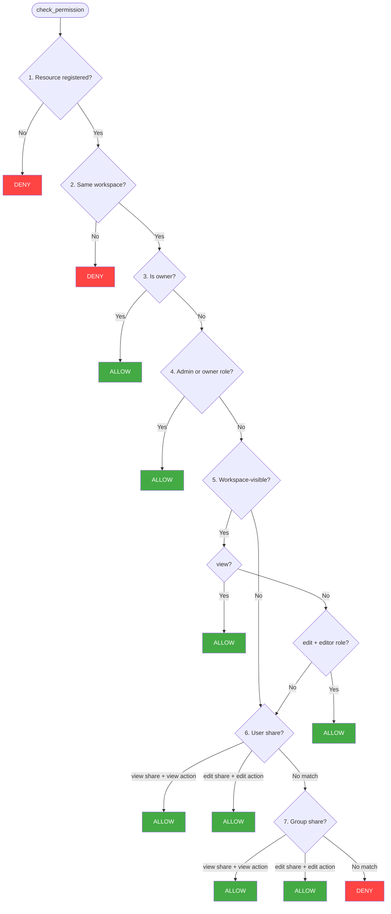

# Entity Permissions (ACLs)

Per-resource access control: "can user X view document Y?" Resources are registered with Sentinel using a generic model. Access is resolved through ownership, visibility, and explicit shares.

```python
# Register a resource when it's created
await sentinel.permissions.register_resource(
    resource_type="document",
    resource_id=doc.id,
    workspace_id=user.workspace_id,
    owner_id=user.user_id,
    visibility="workspace",
)

# Check access
allowed = await sentinel.permissions.can(token, "document", doc.id, "edit")

# Share with another user
await sentinel.permissions.share(
    token=token,
    resource_type="document",
    resource_id=doc.id,
    grantee_type="user",
    grantee_id=collaborator_id,
    permission="edit",
)
```

## Resource Model

Every resource is identified by three fields, making the system generic across services:

| Field | Type | Example |
|-------|------|---------|
| `service_name` | string | `"docu-store"` |
| `resource_type` | string | `"document"` |
| `resource_id` | UUID | `"a1b2c3d4-..."` |

Additional fields on registration:

| Field | Type | Description |
|-------|------|-------------|
| `workspace_id` | UUID | The workspace this resource belongs to |
| `owner_id` | UUID | The user who owns the resource |
| `visibility` | string | `"private"` or `"workspace"` (default: `"workspace"`) |

The `(service_name, resource_type, resource_id)` tuple is unique. Registration is idempotent (upsert with `ON CONFLICT DO NOTHING`).

## Visibility

| Mode | Behavior |
|------|----------|
| `private` | Only the owner and users/groups with explicit shares can access |
| `workspace` | All workspace members can view; editors can also edit |

Change visibility after registration:

```
PATCH /permissions/{permission_id}/visibility
X-Service-Key: your-service-key
{ "visibility": "private" }
```

## Permission Resolution

The `check_permission` function follows a 7-step algorithm, short-circuiting at the first match:



### Step by Step

1. **Resource registered?** Look up by `(service_name, resource_type, resource_id)`. Not found = deny.
2. **Same workspace?** The resource's `workspace_id` must match the user's JWT `wid`. Cross-workspace = deny.
3. **Owner?** If `owner_id == user_id`, full access (view and edit).
4. **Admin/owner role?** Workspace admins and owners have full access to all resources in the workspace.
5. **Workspace-visible?** If `visibility = "workspace"`: all members can view; users with `editor` role can also edit. Viewers cannot edit unless they have an explicit share.
6. **User share?** Check `resource_shares` for `grantee_type = "user"`, `grantee_id = user_id`. A `view` share grants view; an `edit` share grants both view and edit.
7. **Group share?** Check `resource_shares` for `grantee_type = "group"`, `grantee_id IN (user's group IDs from JWT)`. Same permission logic as user shares.
8. **Default deny.**

## Share Types

Shares grant access to individual users or [groups](groups.md):

| `grantee_type` | `permission` | Effect |
|---|---|---|
| `user` | `view` | User can view the resource |
| `user` | `edit` | User can view and edit the resource |
| `group` | `view` | All group members can view |
| `group` | `edit` | All group members can view and edit |

### Creating Shares

The grantee must belong to the same workspace as the resource. Sharing with a user who isn't a workspace member or a group from another workspace returns `400 Bad Request`.

```python
# Share with a user (must be a workspace member)
await sentinel.permissions.share(
    token=token,
    resource_type="document",
    resource_id=doc_id,
    grantee_type="user",
    grantee_id=user_id,
    permission="edit",
)

# Share with a group
await sentinel.permissions.share(
    token=token,
    resource_type="document",
    resource_id=doc_id,
    grantee_type="group",
    grantee_id=group_id,
    permission="view",
)
```

### Revoking Shares

```
DELETE /permissions/{permission_id}/share
X-Service-Key: your-service-key
{ "grantee_type": "user", "grantee_id": "user-uuid" }
```

## Accessible Resources Lookup

List all resource IDs a user can access, useful for filtered list views:

```python
resource_ids, has_full_access = await sentinel.permissions.accessible(
    token=token,
    resource_type="document",
    action="view",
    workspace_id=workspace_id,
)

if has_full_access:
    # Admin/owner — skip filtering, show everything
    docs = await get_all_docs(workspace_id)
else:
    docs = await get_docs_by_ids(resource_ids)
```

When `has_full_access` is `True` (admin/owner with no limit), `resource_ids` may be empty -- the caller should skip ID filtering entirely.

## Database Schema

```
resource_permissions              One row per registered resource
  UNIQUE(service_name, resource_type, resource_id)
  FK workspace_id -> workspaces (CASCADE)
  FK owner_id -> users (SET NULL)
  CHECK visibility IN ('private', 'workspace')

resource_shares                   Grants on resources
  FK resource_permission_id -> resource_permissions (CASCADE)
  UNIQUE(resource_permission_id, grantee_type, grantee_id)
  CHECK grantee_type IN ('user', 'group')
  CHECK permission IN ('view', 'edit')
```
