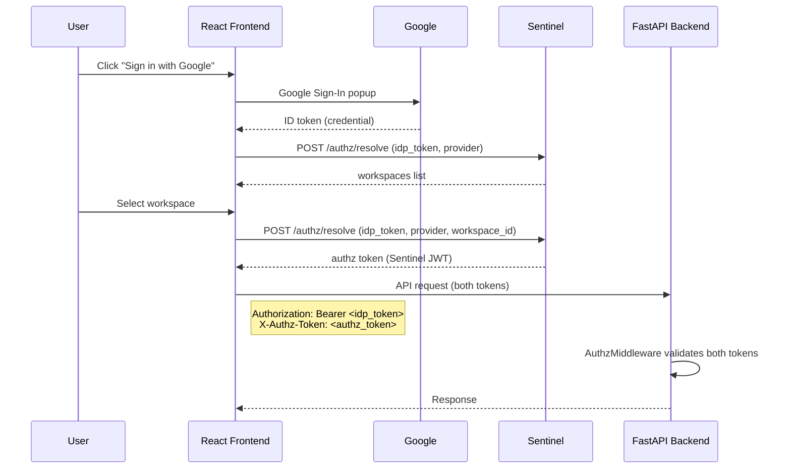

# Tutorial: Build Your First App

Build a **Team Notes** app — a FastAPI backend with a React frontend — that uses Sentinel for authentication and authorization. Users sign in with Google, Sentinel resolves their workspace memberships, and your backend enforces three tiers of access control using the Python SDK.

The complete source code is in the [`demo-authz/`](https://github.com/sidxz/Sentinel/tree/main/demo-authz) directory.

## Prerequisites

- Sentinel running locally ([Installation](../getting-started/installation.md), [Quickstart](../getting-started/quickstart.md))
- A Google OAuth Client ID ([Google Cloud Console](https://console.cloud.google.com/apis/credentials))
- A service app registered in the Sentinel admin panel
- Python 3.12+ and Node.js 18+

## What You'll Build

A note-taking app that demonstrates all three authorization tiers:

| Tier | Feature | SDK API |
|------|---------|---------|
| **Workspace Roles** | Editors create notes, admins delete | `require_role("editor")` |
| **Custom RBAC** | Export requires a registered action | `sentinel.require_action("notes:export")` |
| **Entity ACLs** | Per-note access control | `sentinel.permissions.can()` |

### How It Works



The frontend authenticates users directly with Google and calls Sentinel to resolve their workspace memberships. Every API request carries two tokens: the IdP token (proving identity) and the Sentinel authz token (proving authorization). The backend middleware validates both.

---

## Step 1: Create the Backend

Create a new FastAPI project that depends on the SDK:

```toml title="demo-authz/backend/pyproject.toml"
[project]
name = "demo-team-notes-authz"
version = "0.1.0"
description = "Team Notes — Sentinel AuthZ mode demo"
requires-python = ">=3.12"
dependencies = [
    "fastapi>=0.115.0",
    "uvicorn[standard]>=0.34.0",
    "pydantic-settings>=2.7.0",
    "sentinel-auth-sdk",
]
```

Install dependencies:

```bash
cd demo-authz/backend
uv sync
```

!!! tip "Editable installs for SDK development"
    If you're working on the SDK itself and want changes reflected immediately, add a `[tool.uv.sources]` section pointing to your local SDK checkout:

    ```toml
    [tool.uv.sources]
    sentinel-auth-sdk = { path = "../../sdk", editable = true }
    ```

## Step 2: Configure Sentinel SDK

Create `src/config.py` with the `Sentinel` instance. The `mode="authz"` flag tells the SDK to validate dual tokens (IdP + authz) instead of a single Sentinel-issued JWT:

```python title="demo-authz/backend/src/config.py"
import httpx
from cryptography.hazmat.primitives.serialization import Encoding, PublicFormat
from jwt.algorithms import RSAAlgorithm
from pydantic_settings import BaseSettings, SettingsConfigDict

from sentinel_auth import Sentinel


class Settings(BaseSettings):
    model_config = SettingsConfigDict(
        env_file=".env", env_file_encoding="utf-8", extra="ignore"
    )

    sentinel_url: str = "http://localhost:9003"
    service_name: str = "team-notes"
    service_api_key: str = ""
    idp_public_key: str = ""
    idp_jwks_url: str = "https://www.googleapis.com/oauth2/v3/certs"
    host: str = "0.0.0.0"
    port: int = 9200
    frontend_url: str = "http://localhost:5174"


settings = Settings()


def _resolve_idp_public_key() -> str:
    """Get IdP public key from config or fetch from JWKS URL."""
    if settings.idp_public_key:
        return settings.idp_public_key

    # Fetch first key from IdP's JWKS endpoint
    resp = httpx.get(settings.idp_jwks_url, timeout=10.0)
    resp.raise_for_status()
    jwks = resp.json()
    key_data = jwks["keys"][0]
    pub_key = RSAAlgorithm.from_jwk(key_data)
    return pub_key.public_bytes(
        Encoding.PEM, PublicFormat.SubjectPublicKeyInfo
    ).decode()


sentinel = Sentinel(
    base_url=settings.sentinel_url,          # Sentinel service URL
    service_name=settings.service_name,       # "team-notes"
    service_key=settings.service_api_key,     # sk_... from admin panel
    mode="authz",                             # dual-token validation
    idp_public_key=_resolve_idp_public_key(), # Google's RSA public key
    actions=[                                 # RBAC actions to register on startup
        {"action": "notes:export", "description": "Export notes as JSON"},
    ],
)
```

Three things to note:

1. **`mode="authz"`** switches the SDK to dual-token mode. The middleware will expect both `Authorization: Bearer <idp_token>` and `X-Authz-Token: <authz_token>` on every request.
2. **`idp_public_key`** is used to verify the IdP token. The helper fetches Google's public key from their JWKS endpoint at startup.
3. **`actions`** are registered with Sentinel on app startup via the lifespan hook, so you can assign them to custom roles in the admin panel.

## Step 3: Add Dual-Token Middleware

Wire the Sentinel instance into your FastAPI app. `sentinel.protect(app)` adds `AuthzMiddleware`, which validates both tokens on every request and populates `request.state.user`:

```python title="demo-authz/backend/src/main.py"
from fastapi import FastAPI
from fastapi.middleware.cors import CORSMiddleware

from src.config import sentinel, settings

app = FastAPI(
    title="Team Notes (AuthZ Mode)",
    version="0.1.0",
    lifespan=sentinel.lifespan,  # (1)!
)

# CORS for the demo frontend
app.add_middleware(
    CORSMiddleware,
    allow_origins=[settings.frontend_url],
    allow_credentials=True,
    allow_methods=["*"],
    allow_headers=["*"],
)

# Dual-token authentication middleware
sentinel.protect(  # (2)!
    app,
    exclude_paths=["/health", "/docs", "/openapi.json", "/redoc"],
)
```

1. The lifespan hook registers RBAC actions with Sentinel on startup.
2. `sentinel.protect()` adds `AuthzMiddleware` which validates the IdP token against Google's public key, validates the authz token against Sentinel's public key, and checks that the `idp_sub` claim in the authz token matches the IdP token's subject.

!!! info "What the middleware validates"
    On every request, `AuthzMiddleware` performs three checks:

    1. **IdP token** (`Authorization` header) -- verified against the Google public key you provided
    2. **Authz token** (`X-Authz-Token` header) -- verified against Sentinel's signing key (fetched automatically)
    3. **Subject binding** -- the `idp_sub` claim in the authz token must match the `sub` claim in the IdP token

    If any check fails, the request receives a `401 Unauthorized` response. After validation, the user context is available as `request.state.user`, just like in proxy mode.

## Step 4: First Protected Endpoint

Use `get_current_user` to access the authenticated user. This dependency works identically regardless of mode -- it reads `request.state.user` which the middleware has already populated:

```python title="demo-authz/backend/src/routes.py"
from fastapi import APIRouter, Depends
from sentinel_auth.dependencies import get_current_user
from sentinel_auth.types import AuthenticatedUser

router = APIRouter()

@router.get("/me")
async def whoami(user: AuthenticatedUser = Depends(get_current_user)):
    """Current user context from dual-token validation."""
    return {
        "user_id": str(user.user_id),
        "email": user.email,
        "name": user.name,
        "workspace_id": str(user.workspace_id),
        "workspace_slug": user.workspace_slug,
        "workspace_role": user.workspace_role,
    }
```

The `AuthenticatedUser` dataclass gives you `user_id`, `email`, `name`, `workspace_id`, `workspace_slug`, `workspace_role`, and `groups`.

## Step 5: Workspace-Scoped Data

Use `get_workspace_id` to scope queries to the current workspace. This ensures users in workspace A never see notes from workspace B, even if they share the same database:

```python
from sentinel_auth.dependencies import get_workspace_id

@router.get("/notes")
async def list_notes(workspace_id: uuid.UUID = Depends(get_workspace_id)):
    """List all notes in the current workspace."""
    return [asdict(n) for n in notes.list_by_workspace(workspace_id)]
```

## Step 6: Enforce Workspace Roles

Use `require_role()` to restrict endpoints by workspace role level:

```python
from sentinel_auth.dependencies import require_role

@router.post("/notes", status_code=201)
async def create_note(
    body: CreateNoteRequest,
    user: AuthenticatedUser = Depends(require_role("editor")),  # (1)!
):
    """Create a note. Requires at least 'editor' workspace role."""
    note = notes.create(
        title=body.title,
        content=body.content,
        workspace_id=user.workspace_id,
        owner_id=user.user_id,
        owner_name=user.name,
    )
    return asdict(note)

@router.delete("/notes/{note_id}")
async def delete_note(
    note_id: uuid.UUID,
    user: AuthenticatedUser = Depends(require_role("admin")),  # (2)!
):
    """Delete a note. Requires at least 'admin' workspace role."""
    if not notes.delete(note_id):
        raise HTTPException(status_code=404, detail="Note not found")
    return {"ok": True}
```

1. Viewers can read, but only editors and above can create.
2. Only admins and owners can delete notes.

The role hierarchy is: **viewer < editor < admin < owner**. A user with `admin` role passes `require_role("editor")`.

## Step 7: Register Resources

When creating a resource that needs entity-level permissions, register it with Sentinel. The `sentinel.permissions` client is already configured with your service key:

```python
@router.post("/notes", status_code=201)
async def create_note(
    body: CreateNoteRequest,
    user: AuthenticatedUser = Depends(require_role("editor")),
):
    note = notes.create(
        title=body.title,
        content=body.content,
        workspace_id=user.workspace_id,
        owner_id=user.user_id,
        owner_name=user.name,
    )

    # Register for ACL management
    await sentinel.permissions.register_resource(
        resource_type="note",
        resource_id=note.id,
        workspace_id=user.workspace_id,
        owner_id=user.user_id,
        visibility="workspace",  # (1)!
    )

    return asdict(note)
```

1. `"workspace"` means all workspace members can view. Other options: `"private"` (owner only) or `"public"` (anyone).

## Step 8: Entity-Level Permissions

Check if a user can view or edit a specific resource:

```python
from sentinel_auth.dependencies import get_current_user, get_token

@router.get("/notes/{note_id}")
async def get_note(
    note_id: uuid.UUID,
    user: AuthenticatedUser = Depends(get_current_user),
    token: str = Depends(get_token),
):
    note = notes.get(note_id)
    if not note:
        raise HTTPException(status_code=404)

    allowed = await sentinel.permissions.can(
        token=token,
        resource_type="note",
        resource_id=note_id,
        action="view",
    )
    if not allowed:
        raise HTTPException(status_code=403, detail="Access denied")

    return asdict(note)
```

The permission system follows a 7-step resolution: owner check, visibility, direct user share, group share, workspace role, and finally deny.

## Step 9: Share Resources

Note owners can share with other users:

```python
@router.post("/notes/{note_id}/share")
async def share_note(
    note_id: uuid.UUID,
    body: ShareNoteRequest,
    user: AuthenticatedUser = Depends(get_current_user),
    token: str = Depends(get_token),
):
    note = notes.get(note_id)
    if note.owner_id != user.user_id:
        raise HTTPException(status_code=403, detail="Only owner can share")

    await sentinel.permissions.share(
        token=token,
        resource_type="note",
        resource_id=note_id,
        grantee_type="user",
        grantee_id=body.user_id,
        permission=body.permission,  # "view" or "edit"
    )
    return {"ok": True}
```

## Step 10: Custom RBAC

The `actions` parameter in the `Sentinel` constructor registers actions with Sentinel on startup. Protect endpoints with `sentinel.require_action()`:

```python
@router.get("/notes/export")
async def export_notes(
    user: AuthenticatedUser = Depends(sentinel.require_action("notes:export")),
    workspace_id: uuid.UUID = Depends(get_workspace_id),
):
    """Export all workspace notes. Requires 'notes:export' RBAC action."""
    workspace_notes = notes.list_by_workspace(workspace_id)
    return {
        "format": "json",
        "count": len(workspace_notes),
        "notes": [asdict(n) for n in workspace_notes],
    }
```

!!! note "Admin setup required"
    An admin must create a role with the `notes:export` action and assign it to users through the Sentinel admin panel before they can access this endpoint. Actions are registered automatically on startup, but role assignments are manual.

---

## Step 11: Build the Frontend

The frontend uses Google Sign-In for authentication and `@sentinel-auth/react` to resolve workspace memberships and make authenticated API calls.

### Install dependencies

```bash
cd demo-authz/frontend
npm install react react-dom @react-oauth/google @sentinel-auth/js @sentinel-auth/react
npm install -D @vitejs/plugin-react typescript vite
```

### Set up providers

Wrap the app with `GoogleOAuthProvider` (for Google Sign-In) and `AuthzProvider` (for Sentinel):

```tsx title="demo-authz/frontend/src/main.tsx"
import { StrictMode } from 'react'
import { createRoot } from 'react-dom/client'
import { GoogleOAuthProvider } from '@react-oauth/google'
import { AuthzProvider } from '@sentinel-auth/react'
import { App } from './App'

const GOOGLE_CLIENT_ID = import.meta.env.VITE_GOOGLE_CLIENT_ID || ''
const SENTINEL_URL = import.meta.env.VITE_SENTINEL_URL || 'http://localhost:9003'

createRoot(document.getElementById('root')!).render(
  <StrictMode>
    <GoogleOAuthProvider clientId={GOOGLE_CLIENT_ID}>
      <AuthzProvider config={{ sentinelUrl: SENTINEL_URL }}>
        <App />
      </AuthzProvider>
    </GoogleOAuthProvider>
  </StrictMode>,
)
```

`AuthzProvider` creates a `SentinelAuthz` client internally and makes it available via the `useAuthz()` hook. The `sentinelUrl` points directly at Sentinel -- the frontend calls `/authz/resolve` to exchange IdP tokens for authz tokens.

### Login with Google Sign-In

Use `@react-oauth/google`'s `GoogleLogin` component for the sign-in button. On success, call `resolve()` to get the user's workspace list from Sentinel:

```tsx title="demo-authz/frontend/src/components/Login.tsx"
import { GoogleLogin } from '@react-oauth/google'
import { useAuthz } from '@sentinel-auth/react'
import type { AuthzWorkspaceOption } from '@sentinel-auth/js'

interface LoginProps {
  onResolved: (idpToken: string, workspaces: AuthzWorkspaceOption[]) => void
}

export function Login({ onResolved }: LoginProps) {
  const { resolve, selectWorkspace } = useAuthz()

  const handleGoogleSignIn = async (credential: string) => {
    const result = await resolve(credential, 'google') // (1)!

    if (result.workspaces.length === 1) {
      // Single workspace -- select automatically
      await selectWorkspace(credential, 'google', result.workspaces[0].id) // (2)!
    } else {
      // Multiple workspaces -- show picker
      onResolved(credential, result.workspaces)
    }
  }

  return (
    <div>
      <h1>Team Notes</h1>
      <GoogleLogin
        onSuccess={(response) => {
          if (response.credential) {
            handleGoogleSignIn(response.credential)
          }
        }}
        onError={() => console.error('Google Sign-In failed')}
      />
    </div>
  )
}
```

1. `resolve(idpToken, provider)` calls Sentinel's `/authz/resolve` endpoint and returns the list of workspaces the user belongs to.
2. `selectWorkspace(idpToken, provider, workspaceId)` calls `/authz/resolve` again with a specific workspace, getting back an authz token. After this, `isAuthenticated` becomes `true`.

### Workspace selection

If the user belongs to multiple workspaces, show a picker:

```tsx title="demo-authz/frontend/src/components/WorkspacePicker.tsx"
import { useAuthz } from '@sentinel-auth/react'
import type { AuthzWorkspaceOption } from '@sentinel-auth/js'

interface WorkspacePickerProps {
  workspaces: AuthzWorkspaceOption[]
  idpToken: string
  onBack: () => void
}

export function WorkspacePicker({ workspaces, idpToken, onBack }: WorkspacePickerProps) {
  const { selectWorkspace } = useAuthz()

  return (
    <div>
      <h2>Select Workspace</h2>
      <ul>
        {workspaces.map((ws) => (
          <li key={ws.id}>
            <button onClick={() => selectWorkspace(idpToken, 'google', ws.id)}>
              <strong>{ws.name}</strong> ({ws.role})
            </button>
          </li>
        ))}
      </ul>
      <button onClick={onBack}>Back</button>
    </div>
  )
}
```

### Three-state app

The app has three states: **Login**, **WorkspacePicker**, and **Notes** (authenticated). Use `isAuthenticated` and `user` from `useAuthz()` to switch between them:

```tsx title="demo-authz/frontend/src/App.tsx"
import { useState } from 'react'
import { useAuthz } from '@sentinel-auth/react'
import type { AuthzWorkspaceOption } from '@sentinel-auth/js'
import { Login } from './components/Login'
import { WorkspacePicker } from './components/WorkspacePicker'
import { Notes } from './components/Notes'

export function App() {
  const { isAuthenticated, user, logout } = useAuthz()
  const [workspaces, setWorkspaces] = useState<AuthzWorkspaceOption[] | null>(null)
  const [idpToken, setIdpToken] = useState<string | null>(null)

  // State 3: Authenticated -- show notes
  if (isAuthenticated && user) {
    return (
      <div>
        <header>
          <span>{user.name} -- {user.workspaceSlug} ({user.workspaceRole})</span>
          <button onClick={logout}>Logout</button>
        </header>
        <Notes />
      </div>
    )
  }

  // State 2: Workspaces resolved -- show picker
  if (workspaces && idpToken) {
    return (
      <WorkspacePicker
        workspaces={workspaces}
        idpToken={idpToken}
        onBack={() => { setWorkspaces(null); setIdpToken(null) }}
      />
    )
  }

  // State 1: Not authenticated -- show login
  return (
    <Login
      onResolved={(token, ws) => {
        setIdpToken(token)
        setWorkspaces(ws)
      }}
    />
  )
}
```

### Authenticated API calls

Use `fetchJson` from `useAuthz()` to make authenticated requests. It automatically attaches both headers (`Authorization: Bearer <idp_token>` and `X-Authz-Token: <authz_token>`):

```tsx title="demo-authz/frontend/src/components/Notes.tsx"
import { useEffect, useState } from 'react'
import { useAuthz } from '@sentinel-auth/react'

const BACKEND = import.meta.env.VITE_BACKEND_URL || 'http://localhost:9200'

interface Note {
  id: string
  title: string
  content: string
  owner_name: string
}

export function Notes() {
  const { fetchJson } = useAuthz()
  const [notes, setNotes] = useState<Note[]>([])
  const [title, setTitle] = useState('')
  const [content, setContent] = useState('')

  const loadNotes = async () => {
    const data = await fetchJson<Note[]>(`${BACKEND}/notes`) // (1)!
    setNotes(data)
  }

  useEffect(() => { loadNotes() }, [])

  const createNote = async () => {
    if (!title.trim()) return
    await fetchJson(`${BACKEND}/notes`, {
      method: 'POST',
      body: JSON.stringify({ title, content }),
    })
    setTitle('')
    setContent('')
    await loadNotes()
  }

  return (
    <div>
      <h2>Notes</h2>
      <div>
        <input placeholder="Title" value={title} onChange={(e) => setTitle(e.target.value)} />
        <textarea placeholder="Content" value={content} onChange={(e) => setContent(e.target.value)} />
        <button onClick={createNote}>Create Note</button>
      </div>
      {notes.map((note) => (
        <div key={note.id}>
          <strong>{note.title}</strong>
          <p>{note.content}</p>
          <small>by {note.owner_name}</small>
        </div>
      ))}
    </div>
  )
}
```

1. `fetchJson()` sends both tokens automatically. No need to manage headers yourself.

---

## Step 12: Configure and Run

### Register the service app

In the Sentinel admin panel, go to **Service Apps** and register a new service:

1. **Name**: `team-notes`
2. **service_name**: `team-notes`
3. **allowed_origins**: `http://localhost:5174` (the frontend URL)
4. Copy the generated `sk_...` key

!!! warning "allowed_origins is required"
    The frontend calls Sentinel's `/authz/resolve` endpoint directly. The service app's `allowed_origins` must include the frontend URL or the browser will block the request with a CORS error.

### Configure Google OAuth

In the [Google Cloud Console](https://console.cloud.google.com/apis/credentials):

1. Create an OAuth 2.0 Client ID (Web application)
2. Add `http://localhost:5174` to **Authorized JavaScript origins**
3. Copy the Client ID

### Environment files

=== "Backend"

    ```dotenv title="demo-authz/backend/.env"
    # Sentinel
    SENTINEL_URL=http://localhost:9003
    SERVICE_API_KEY=sk_...  # (1)!

    # IdP key resolution (Google)
    IDP_JWKS_URL=https://www.googleapis.com/oauth2/v3/certs

    # Frontend (for CORS)
    FRONTEND_URL=http://localhost:5174
    ```

    1. Paste the service key from the admin panel.

=== "Frontend"

    ```dotenv title="demo-authz/frontend/.env"
    VITE_GOOGLE_CLIENT_ID=your-client-id.apps.googleusercontent.com  # (1)!
    VITE_SENTINEL_URL=http://localhost:9003
    VITE_BACKEND_URL=http://localhost:9200
    ```

    1. From Google Cloud Console.

### Start the services

Open three terminals:

```bash
# Terminal 1: Sentinel
make start  # runs on :9003
```

```bash
# Terminal 2: Backend
cd demo-authz/backend && uv sync && uv run python -m src.main  # runs on :9200
```

```bash
# Terminal 3: Frontend
cd demo-authz/frontend && npm install && npm run dev  # runs on :5174
```

Open [http://localhost:5174](http://localhost:5174) and sign in with Google.

!!! tip "Test the full flow"
    1. Click **Sign in with Google** and authenticate
    2. Select a workspace (or auto-selected if you only have one)
    3. Create a note (requires editor role or above)
    4. Try deleting a note (requires admin role or above)

---

## Summary

| What | How | SDK API |
|------|-----|---------|
| Authenticate users | Dual-token middleware (IdP + authz) | `sentinel.protect(app)` |
| Get user context | FastAPI dependency | `get_current_user` |
| Isolate workspaces | Filter data by workspace_id | `get_workspace_id` |
| Enforce roles | Minimum role check | `require_role("editor")` |
| Register resources | On creation, register for ACLs | `sentinel.permissions.register_resource()` |
| Check entity access | Per-resource permission check | `sentinel.permissions.can()` |
| Share resources | Grant access to other users | `sentinel.permissions.share()` |
| Custom RBAC | Register actions, check at runtime | `sentinel.require_action("notes:export")` |
| Frontend auth | Google Sign-In + AuthzProvider | `useAuthz()`, `resolve()`, `selectWorkspace()` |
| Authenticated fetch | Auto dual-header injection | `fetchJson()` from `useAuthz()` |

## Next Steps

- [Next.js Frontend Tutorial](tutorial-nextjs.md) -- build the same app with Next.js App Router, Edge Middleware, and server helpers
- [Python SDK Reference](../sdk/index.md) -- full API documentation for all SDK modules
- [JS SDK Reference](../js-sdk/index.md) -- `@sentinel-auth/js` and `@sentinel-auth/react` API docs
- [Integration Guide](../sdk/integration.md) -- detailed integration reference
- [Examples](../sdk/examples.md) -- common patterns and recipes
